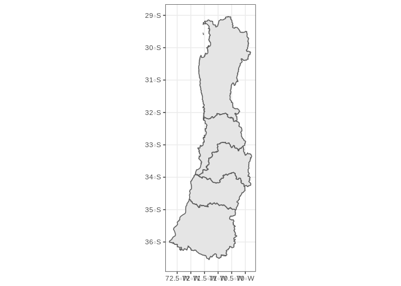
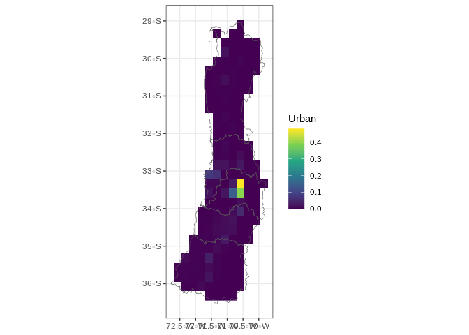

Using Historical and landuse changes made for CMIP6
================

## Objective and background

The objective of this repository is to show how to use the *NetCDF*
available on the future harmonized land-use forcing [dataset for
CMIP6](https://luh.umd.edu/data.shtml#LUH1_Data), which includes the
historical dataset form 850-2016 and the proyections from 2015 to 2100,
plus the recent expanded version till 2300.

### Files and packages needed

For any of the periods above from the link the file **states.nc**, and
name it accordingly to remember which time period an SSP has been
imported. The packages needed for all of this to work are:

  - ncdf4
  - raster
  - sf
  - tidyverse

### Loading and extracting information from NC files

``` r
library(ncdf4)
library(raster)
library(sf)
library(tidyverse)
```

The fist thing to do is to load the file in order to get the info from
the file, we will first do that for the present:

``` r
Present <- nc_open("states.nc")
```

All the NetCDF files of land use have 3 dimensions (latitude, longitude
and year) and the variables shown in the table bellow:

| Name        | Long\_Name                              | NA\_Value |
| :---------- | :-------------------------------------- | --------: |
| primf       | forested primary land                   |     1e+20 |
| primn       | non-forested primary land               |     1e+20 |
| secdf       | potentially forested secondary land     |     1e+20 |
| secdn       | potentially non-forested secondary land |     1e+20 |
| urban       | urban land                              |     1e+20 |
| c3ann       | C3 annual crops                         |     1e+20 |
| c4ann       | C4 annual crops                         |     1e+20 |
| c3per       | C3 perennial crops                      |     1e+20 |
| c4per       | C4 perennial crops                      |     1e+20 |
| c3nfx       | C3 nitrogen-fixing crops                |     1e+20 |
| pastr       | managed pasture                         |     1e+20 |
| range       | rangeland                               |     1e+20 |
| secmb       | secondary mean biomass carbon density   |     1e+20 |
| secma       | secondary mean age                      |     1e+20 |
| lat\_bounds | lat\_bounds                             |     1e+30 |
| lon\_bounds | lon\_bounds                             |     1e+30 |

### Reading the table dimensions

The first step is to read the dimensions, that is time, lat and lon

``` r
time <- ncvar_get(Present, "time")

lat <- ncvar_get(Present, "lat")

lon <- ncvar_get(Present, "lon")
```

each one of this variables will get us an array:

  - **time:** years since the year 850
  - **lat:** latitude in degrees\_north
  - **lon:** longitude in degrees\_east

The order of this dimensions is important, since when reading it as a
layer we can read part of the file, and this is assinged as an array,
this will be most sensitive for *time*, because this is a world layer
with 1166 time layers, which would be hard to handle for most computers
**in most times you want to read only part of the time-slices**, more
details on the methods for this can be taken from
\[@hurtt2011harmonization\]

### Pulling a variable from the file and croping it to a raster

As an example for this repository a polygon of central Chile shown
bellow as an SF polygon and available in this repository:

``` r
Chile <- read_rds("Chile_Central.rds")
```

<!-- -->

In the code bellow we will read the files from year 1950 till the
present for the urban environment, in order to do that it is key to
understand that we have to start reading from year 1950 which
corresponds to the 1100th year in the *time dimension*. And we also need
to find the variable for urban in the *Name* column in the table above,
given that we would read the Urban data as follows:

``` r
Urban <- ncvar_get(Present, "urban", start = c(1,#lon
                                            1,#lat
                                            1100# time
                                            ))
```

This will also be an array, the following code will loop it and crop it
to fit the polygon above

``` r
Stack <- list()
for(y in 1:dim(Urban)[3]){
  Time <- Urban[,,y]
  Stack[[y]] <- raster(t(Time), 
                       xmn = min(lon), xmx = max(lon),
                       ymn = min(lat), ymx = max(lat)) %>%   crop(Chile)
}
Stack <- Stack %>% reduce(stack) %>% mask(Chile)%>% readAll()
```

The result will be a stack where each layer will be a time-slice. In
this case 67 the proportion of Urban area in each cell if we look at the
latest this is the result:

<!-- -->

### Closing conection with the file

The last step is to close the conection with the *NetCDF* file

``` r
nc_close(Present)
```

## References
